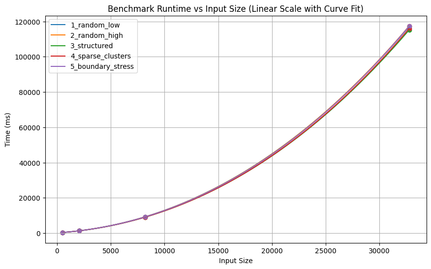
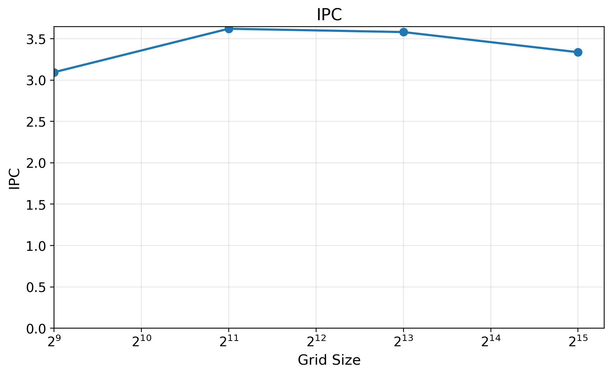
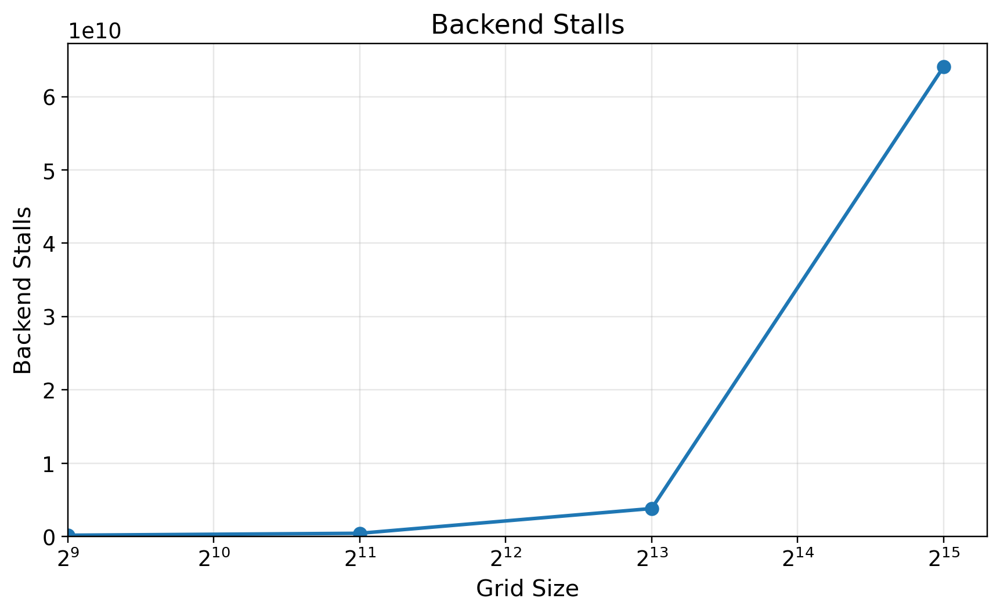
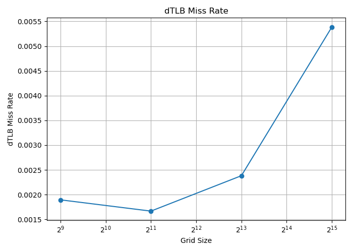
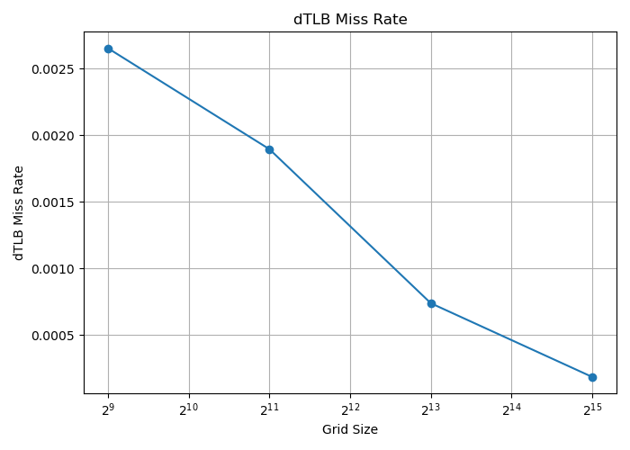

# Design Document — Monster Spawning Grid

**Name:** rocky_grace_save_stars
**Date:** 29/5/2026
**Final median time (10 runs, public\_1):** 105670.565 ms
**Reference median time (10 runs, public\_1):** ~ 122400000 ms
**Speedup:** ~ 1160 ×

---

## 1. Cell Representation

The grid is stored as three separate bit-planes: `adults`, `juveniles`, `eggs`. Each is a flat row-major array of `uint64_t` words with 64 cells per word.

**Why three planes instead of a packed 2-bit encoding?**
Neighbour counting only ever reads the adult plane. Keeping it separate means the stencil reads exactly `N²/8` bytes with no masking or decoding. A packed 2-bit encoding would require extracting the adult bit from every word on every stencil read.

**Why not one byte per cell?**
At `N = 32 768`, a byte-per-cell grid is 1 GiB per buffer (one current and one next). Three bit-planes at 128 MiB each, with four planes active at once, totals 512 MiB — a 4× smaller working set and proportionally less memory bandwidth per generation.

**In-place adult write (`inplace_adults`).**
The next-adult mask is simply `(current_adults & survive_mask) | current_juveniles`: surviving adults plus every juvenile, which matures unconditionally. The kernel writes this directly into `current_juveniles` rather than allocating a separate scratch plane. Generation rotation then costs three pointer swaps:

```
adults <- juveniles <- eggs <- next_eggs
```

No data is copied; this also eliminates one full write pass per generation.

**Self-inclusive counts.**
The horizontal partial at column `c` sums the adult bits at `{c-2, c-1, c, c+1, c+2}`, including the center cell. The full vertical 5-row sum therefore counts the entire 5x5 box including self. The transition thresholds shift by +1 to compensate: ADULT survives if `V in [5,10]` instead of `A in [4,9]`, and EGG spawns if `V in [3,5]` (unchanged, since empty cells contribute 0). This removes a center-subtraction from the inner loop.

---

## 2. Parallelisation Strategy

The simulation runs eight `std::thread` workers, one per physical core, synchronised by a single `std::barrier` with a completion function. The completion function runs atomically at the barrier's reset point and performs the generation plane rotation (`adults ← juveniles ← eggs ← next_eggs`), replacing an earlier design that used two separate barriers and an explicit atomic swap step. Each worker owns a contiguous stripe of rows for the entire run, computed once by `compute_row_range`.

The stripe assignment is static. Interior rows (`[2, N-3]`) only read from source planes that no other worker writes during the same generation, so no locks or atomics are needed inside a generation. Each worker also maintains private scratch (the row-partial ring and rolling accumulator) that would be expensive to reinitialise if the partition changed each generation.

`pthread_setaffinity_np` pins each worker to a fixed CPU. Without pinning, the OS can migrate a thread mid-generation, evicting its L2-resident scratch onto a cold core.

**Why not `std::execution::par`?**
Three reasons: (1) no thread affinity control, so the backing pool can migrate workers freely, defeating cache warmth across generations; (2) no persistent per-worker scratch state across calls, meaning the five-row ring and rolling accumulator would need to be rebuilt every generation; (3) no guarantee on partition shape, so the contiguous row-stripe alignment required by the 5-row stencil halo cannot be enforced.

---

## 3. SIMD Strategy

The implementation uses NEON. On Neoverse-V2, NEON and SVE2 have the same 128-bit register width, so width is not the argument. The hot kernel is almost entirely bitwise operations: CSA trees, a borrow-propagation subtractor, and a boolean transition network. Four NEON instructions map directly onto these: `vsriq_n_u64`/`vsliq_n_u64` fuse a shift and a bit-insert into one instruction; `vbslq_u64` expresses a bit-select (conditional AND-OR) in one instruction; `vbicq_u64` computes `a & ~b` without a separate NOT step; and `veor3q_u64` (FEAT_SHA3, present on Neoverse-V2) computes a 3-input XOR in one instruction. Empirically, NEON proved measurably faster than the equivalent SVE2 path.

### Carry-Save Adder tree (`csa_tree`)

Five shifted adult masks are reduced to a 3-plane bit-sliced integer in `[0,5]` via two CSA stages:

```
Stage 1:  left_2 + left_1 + curr    ->  (sum_1, carry_1)
Stage 2:  right_1 + right_2 + sum_1 ->  (sum_2, carry_2)

b0 = sum_2
b1 = carry_1 XOR carry_2            <- veor3q_u64 in one instruction (FEAT_SHA3)
b2 = carry_1 AND carry_2
```

A CSA takes three equal-weight inputs and produces a sum bit and a carry bit without propagating carry across bit lanes. The carry (majority gate) is computed as:

```
carry = vbslq_u64(c, a | b, a & b)
      = (a | b) where c=1, (a & b) where c=0  =  majority(a, b, c)
```

Two CSA stages reduce five inputs to a 3-bit result with no carry chains, processing all 128 cells in the tile simultaneously.

### Cross-word bit shifts (`sli_sri`)

The five neighbour views require bits from adjacent words when shifting near word boundaries. `vsriq_n_u64` (shift-right-and-insert) handles this in one instruction:

```
left_2 = vsriq_n_u64(vshlq_n_u64(curr_v, 2), prev_adj, 62)
       = keep top 2 bits of (curr << 2), fill low 2 bits with prev >> 62
       = (curr << 2) | (prev >> 62)
```

The symmetric right-neighbour views use `vsliq_n_u64` (shift-left-and-insert) in the same way. Both instructions replace a shift + OR pair with a single fused instruction. The tile load alignment makes this exact: loading `prev = [word 2k-1, word 2k]` means both cross-word carry bits for the two tile lanes are already present in one register.

### Tile layout (`pair2`, `aos`)

```cpp
struct alignas(16) HorizontalPartialPair2 {
    uint64_t b0[2], b1[2], b2[2];
};
```

Two adjacent words are packed into one struct so that each 2-element array is exactly one NEON register load or store. The array-of-structs layout keeps all three bit-planes of a tile contiguous in memory, so loading a tile is three sequential cache-line-aligned loads that the prefetcher handles naturally.

### Transition network (`bsl`)

The NEON transition network avoids precomputing NOT values entirely by using `vbicq_u64` (`a & ~b`) directly. The survival condition is built as:

```
A = vbicq_u64(b2, b3) & b1_or_b0           — b2 & ~b3 & (b1|b0),  selects V in {5,6,7}
B = vbicq_u64(vbicq_u64(b3, b2), b1_and_b0) — b3 & ~b2 & ~(b1&b0), selects V in {8,9,10}
adult_5_to_10 = vbicq_u64(A | B, b4)        — mask out V >= 16
```

Zero explicit NOT registers; every complement is folded into a `vbicq`. The final output uses `vbslq_u64` as a fused select:

```
next_adult = vbslq_u64(adult_word, adult_5_to_10, juvenile_word)
           = adult_5_to_10 where adult=1, juvenile_word where adult=0
```

Since adult and juvenile planes are mutually exclusive, this correctly computes `(adult & survive) | juvenile` in one instruction.

### Branchless subtraction (`branchless_subtract`)

Sliding the vertical window subtracts the outgoing partial from the 5-plane accumulator. The NEON borrow-propagation network uses `vbicq_u64` for borrow init, `vbslq_u64` to fuse the borrow-out expression, and `veor3q_u64` for the update:

```
borrow     = vbicq_u64(partial, total)            — partial & ~total
next_borrow = vbslq_u64(borrow,
                vornq_u64(partial, total),         — (partial | ~total) where borrow=1
                vbicq_u64(partial, total))         — (partial & ~total) where borrow=0
new_total  = eor3_u64(total, partial, borrow)      — total XOR partial XOR borrow
```

No branches. Each borrow stage costs three instructions.

### Dual-stream partial computation (`dualpartial`, `fused_incoming`)

When the two-row pipeline needs incoming partials for rows `r+3` and `r+4`, `compute_two_partial_pairs_neon_from_ptrs` interleaves both CSA trees. This lets the CPU overlap the first tree's shifts and carries with the second tree's loads, hiding load latency.

### Aligned hot loop and pointer stepping (`aligned_hot_loop`, `ptrstep`)

Word 1 of each row is handled by a scalar prologue so the NEON loop can start at even word index 2, which is required for the `vsriq`/`vsliq` cross-lane carry to work correctly. The innermost function takes raw pointers and advances them by 2 words per iteration, removing multiply-add address arithmetic from the critical path.

### Exact two-row pipeline (`exact2row`, `rowstep`)

The main loop processes two output rows per iteration. The five accumulator planes are loaded once, two emit steps and two slide steps are applied, then stored once. This halves the number of accumulator load/store operations per output row compared to a single-row loop.

---

## 4. Memory Layout and Tiling

### Working set per worker

At `N = 32 768`, the hot per-worker working set is:

| Structure | Size |
|---|---|
| 5-row horizontal partial ring (`rowcache`) | `5 x (N/64) x 3 x 8` B = **120 KiB** |
| Rolling accumulator, 5 planes x 1 row (`rolling`) | `5 x (N/64) x 8` B = **20 KiB** |
| **Total** | **~140 KiB** |

This fits comfortably in the 512 KiB L2 per Neoverse-V2 core. Source-plane reads are sequential and hardware-prefetched.

### Rolling accumulator and ring (`rolling`, `rowcache`)

Rather than re-summing five partial rows per output row, the kernel maintains a running total updated by one add and one subtract per row:

```
total[r] = total[r-1] - H[r-3] + H[r+2]
```

The five partial rows in the current window live in a circular ring of five slots indexed by `row_index % 5`. When the window slides by one row, the oldest slot is overwritten with the new incoming row.

### Timing across grid sizes



*Figure 1. Wall-clock time for 10 000 generations, N in {64, ..., 32 768}. Median of 10 runs.*

### PMU counters (N = 1 000, 1 000 generations)

| IPC | Backend stalls | L1 miss rate | dTLB miss rate (before) | dTLB miss rate (after) |
|---|---|---|---|---|
|  |  |  |  |  |

---

## 5. What Didn't Work

### 5.1 Column-wise tiling in 128-word segments

We tiled the inner word loop into 128-word segments. Each word is a `uint64_t` processed in pairs via 128-bit SVE registers, so 128 words = 8192 cells per tile slice. The target hot set per tile was estimated as:

- 5 stencil rows x 2 KiB = 10 KiB
- 5 rolling count bit-planes x 2 KiB = 10 KiB
- Horizontal partial ring cache, incoming/outgoing partials, alignment scratch: ~12-24 KiB

Estimated total: ~32-48 KiB, targeting the 64 KiB L1-D per core.

It made things worse. We measured backend stalls using PMU counters and found that only 15-20% of backend stalls were memory-caused, meaning the kernel was already compute-bound. L1 miss data confirmed this: only ~10% of L1 misses were L2 refills, so the rolling accumulator was already largely L2-resident. There was no meaningful cache pressure to relieve. The tiling added per-tile loop overhead (branch, pointer reset, ring bookkeeping) without any offsetting gain.

### 5.2 Contiguous 2 bit memory layout

We tried to store the grid states as 2 contiguous bits, packing 4 cells in one byte. This approach offers the benefit of an intuitively simpler grid handling mechanism at the expense of more complex bitwise operations.

It reduces memory bus pressure but it turned out to be very difficult to optimize.
- SIMD/vectorized operations are harder to implement in this complex format.
- Though the summands fit in 2 bits, the results do not. This would require complex bitwise operations to handle in a data efficient format.
- State transitions are also harder to implement at the bit level.

### 5.3 Unrolling the row iteration loop by 4x

We considered unrolling the row processing loops. The obvious benefits are:
- Amortizes loop tracking and branching overhead
- Allows for better reordering to minimize load-use and dependency stalls
- Allows OoO cores and superscalar cores to better exploit ILP
- Helps the hardware prefetcher schedule reads better

We unrolled from 1 to 2 rows per iteration. This resulted in a performance improvement of a few seconds.

We then tried to unroll the loop to 4 rows to exploit more ILP but it resulted in degraded performance. This may have been due to the compiler not being able to optimize the tight loops. We have 20-30 live variables in a single row hot loop. A double row hot loop will increase this number by a smaller amount due to overlaps. A 4x row loop will increase this by much more causing the compiler to spill variables onto stack which is disastrous.

---

## 6. What You Would Do With Another Week

Four directions seem most likely to yield measurable gains:

**Dependency scheduling.** The dominant bottleneck identified by `perf annotate` is dependency stalls, not memory. Better instruction ordering — either by restructuring the algorithm to expose more independent computation or by writing the hot helpers in a way that gives the compiler more scheduling freedom — would directly reduce stalled cycles.

**Deeper NEON/SVE2 micro-architecture tuning.** There are likely further gains in the partial-computation and transition-network sections from examining instruction latencies, port contention, and load-use hazard patterns at the Neoverse-V2 micro-architecture level. This includes looking at prefetch insertion and load scheduling for the five rolling accumulator planes.

**Alternative neighbour counting strategies.** The current approach uses a sliding window of horizontal partials. Approaches worth evaluating include tracking only live cells (beneficial on sparse grids), LUT-based state transitions, and tiled prefix sums that amortize partial computation across multiple output rows simultaneously.

**Finer profiling granularity.** The current tooling (`perf stat`, `perf annotate`) identifies hotspots at the function level. Instruction-level PMU sampling with cycle-accurate attribution would make it easier to pinpoint which specific dependency chains account for the stall budget and validate the effect of individual changes.

---

## 7. Benchmark Methodology

We initially used a lightweight correctness/performance harness (`run_tests.py`) during early iteration, then switched to a dedicated benchmarking script (`analysis.sh`) for automated compilation, correctness testing, profiling, and repeated evaluation under fixed conditions.

The script builds optimized and debug/profile binaries, verifies correctness on all 512×512 grids for 10K generations, and profiles primarily on 32768×32768 grids.

We used `perf stat` in two main configurations:

- `cycles`, `instructions`, `stalled-cycles-backend`, `stall_backend_mem` to measure IPC, backend stalls, and dependency pressure.
- `cycles`, `instructions`, `L1-dcache-load-misses`, `l2d_cache_refill_rd`, `l2d_cache_wr` to analyze cache and memory behavior.

Scaling runs additionally monitored `cache-misses`, `dTLB-loads`, `dTLB-load-misses`, and backend stalls across multiple grid sizes. We used `perf record`, `perf report`, and `perf annotate` in two modes: `-e cache-misses` to study cache and memory bottlenecks, and `-e cycles` to analyze execution hotspots, dependency chains, and load-use hazard stalls.

Each scaling configuration was run 3 times and the median result was used. We controlled for fixed CPU frequency, fixed CPU affinity (`taskset`), ASLR disabled, warm page cache after initial runs, and transparent huge page configuration. Optimizations were evaluated incrementally by changing one component at a time and comparing perf counters and hotspot distributions across runs.